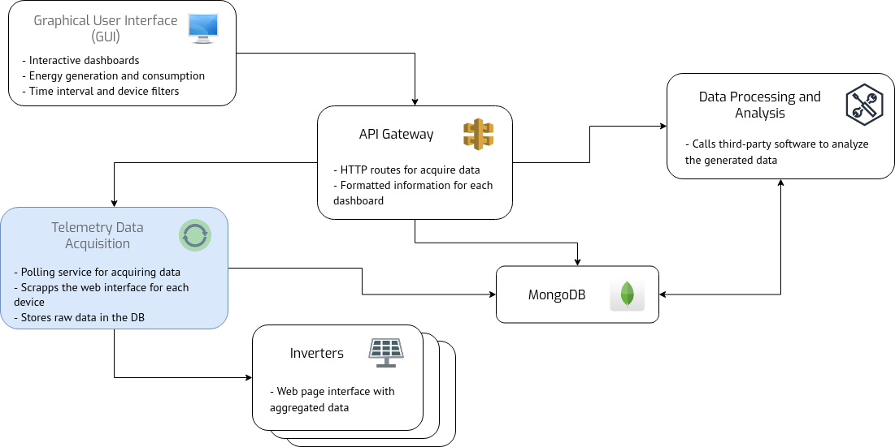

# cpid-solar-telemetry
Data acquisition service for the CPID photovoltaic system. 

## General application

This service represents the data input, from the inverters, in the CPID PV System monitoring. Its role is to communicate with each device and poll for the most recent data, storing it in the DB.



The main tasks for this service are:

1. Acquire and update the status of each inverter in DB
2. Acquire raw telemetry data and store in DB
3. Update the hourly, daily, weekly and yearly summaries of aggregated telemetry data (TODO)

## Data models and relationships

In order to display the required data, some models have been defined in the given service. The `Inverter` class has the current state for each device in the PV system, while the `TelemetryData` class the average measurements for a time interval (~5 minutes). Support classes like `TelemetryHourlyData`, `TelemetryDailyData`, `TelemetryWeeklyData`, `TelemetryMonthlyData` and `TelemetryYearlyData` are necessary for synchronizing the information for each device and obtain the system total.


## Required environment variables

Following the `.env.example` file, the required configuration for this service is:

1. DB_HOST: the name or address that identifies the MongoDB instance  
2. DB_PORT: the port of the MongoDB instance  
3. DB_USER: the user with permissions in the DB  
4. DB_PASSWORD: the password for the given user  
5. DB_DATABASE: the database for which the user has permissions  
6. APP_HOST: the IP that holds the raw current data of the inverters
7. APP_PORT: the port on which the raw current data of the inverters can be found
8. INVERTER_PATHS: the paths for finding each inverter, separated by comma
9. TELEMETRY_PATHS: the paths for finding each telemetry data, separated by comma
10. INVERTER_ACQ_PERIOD: the period for polling each inverter, in seconds
11. TELEMETRY_ACQ_PERIOD: the period for polling each telemetry data, in seconds

## Testing procedure

In order to run tests in an docker environment, the `docker-compose.test.yaml` and `.env.test files have been developed. To run a docker test one must type:
```
docker-compose -f docker-compose.test.yaml up --build --abort-on-container-exit
```
A brief coverage report is shown in the console log.  
If one wants to inspect in a more detailed way, the environment variables must be defined locally and the `mongo-test` service must be launched separately, with the port mapping to the current machine. After that, one might run in the console:
```
go test ./api -v -coverpkg=./api/... -coverprofile cover.html && go tool cover -html cover.html
```
An interface for exploring covered and uncovered code will be launched in the browser, allowing the developer to improve the program testing.
To clear the written data after the local tests, one can use:
```
docker-compose -f docker-compose.test.yaml down
docker volume prune -f
```
